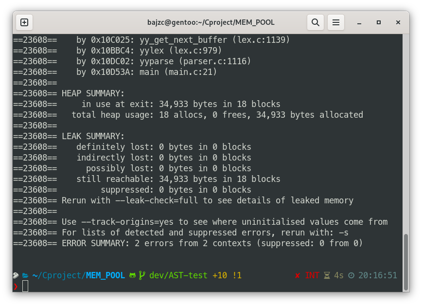

## AST-test

The implement by using AST tree.

### Features:

| Feature                      | Example                               |
|------------------------------|---------------------------------------|
| Arithmetic operators        | + - * / % ^                           |
| Comparison operators        | < <= == >= >                          |
| Postfix operators           | ++ --                                 |
| No declaration for variables | a=1;                                  |
| Multi-scope symbol table     | \                                     |
| Functions declaration        | define next(n){ printf("%d",n+1); }   |
| Function calls               | next(1+1);                            |

### Build

`make all`

## Examples

### 1. Fibonacci

``` C
define fib(n){
    a = 0;b = 1;temp = 0;i = 1;
    while(i < n){
        temp = a+b;
        a = b;
        b = temp;
        i++;
    }
    printf("Fibonacci[%d]: %d\n",n,b);
}

a=1;
while(a<1000000){
    a++;
    b=1;
    while(b<10){
        b++;
        fib(b);
    }
}
```

`time cat fibonacci.test | ./a.out`

#### output:
```
......
Fibonacci[2]: 1
Fibonacci[3]: 2
Fibonacci[4]: 3
Fibonacci[5]: 5
Fibonacci[6]: 8
Fibonacci[7]: 13
Fibonacci[8]: 21
Fibonacci[9]: 34
Fibonacci[10]: 55

```

|malloc function| file     |time taken |
|---------------|----------|-----------|
|malloc()       |malloc.h  |25.202s    |
|mem_malloc()   |mem_pool.h|22.152s    |

#### Memory leak:



### 2. Multipilcation

```C
define table(n){
    i = 1;
    while(i <= n){
        j = 1;
        while(j <= i){
            printf("%d x %d = %d\t",j,i,i*j);
            j++;
        }
        printf("\n");
        i++;
    }
}
table(8);
```

output:
```
1 x 1 = 1
1 x 2 = 2       2 x 2 = 4
1 x 3 = 3       2 x 3 = 6       3 x 3 = 9
1 x 4 = 4       2 x 4 = 8       3 x 4 = 12      4 x 4 = 16
1 x 5 = 5       2 x 5 = 10      3 x 5 = 15      4 x 5 = 20      5 x 5 = 25
1 x 6 = 6       2 x 6 = 12      3 x 6 = 18      4 x 6 = 24      5 x 6 = 30      6 x 6 = 36
1 x 7 = 7       2 x 7 = 14      3 x 7 = 21      4 x 7 = 28      5 x 7 = 35      6 x 7 = 42      7 x 7 = 49
1 x 8 = 8       2 x 8 = 16      3 x 8 = 24      4 x 8 = 32      5 x 8 = 40      6 x 8 = 48      7 x 8 = 56      8 x 8 = 64
./a.out  0.00s user 0.00s system 88% cpu 0.001 total
```

### TODO

- [x] Function declaration
- [x] Memory pool
- [ ] GCC JIT