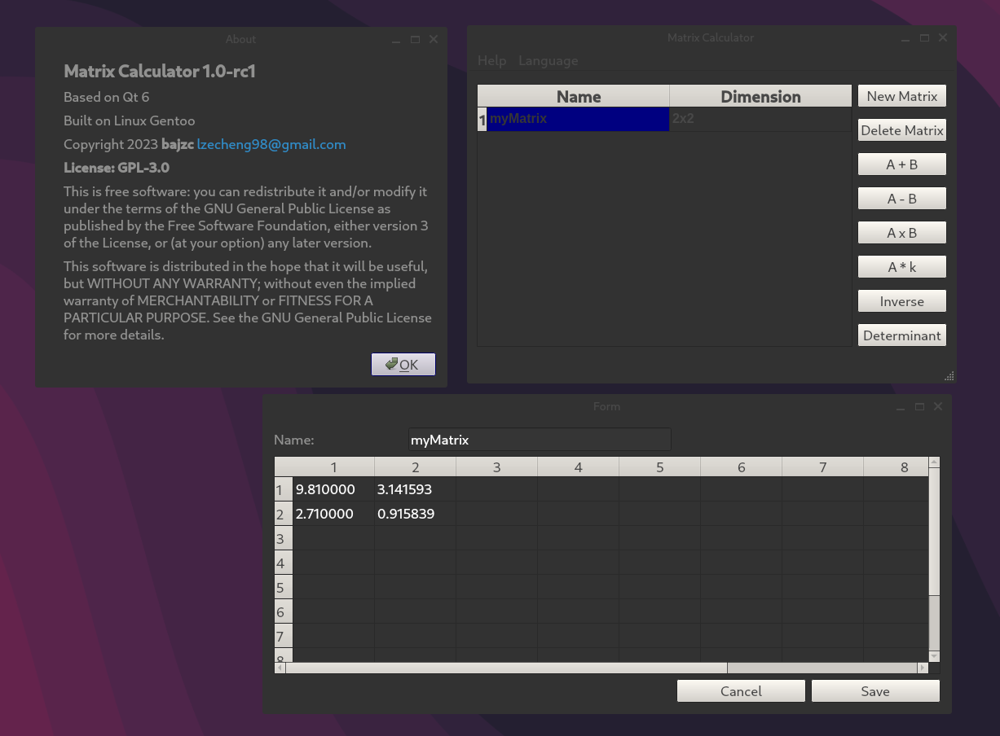
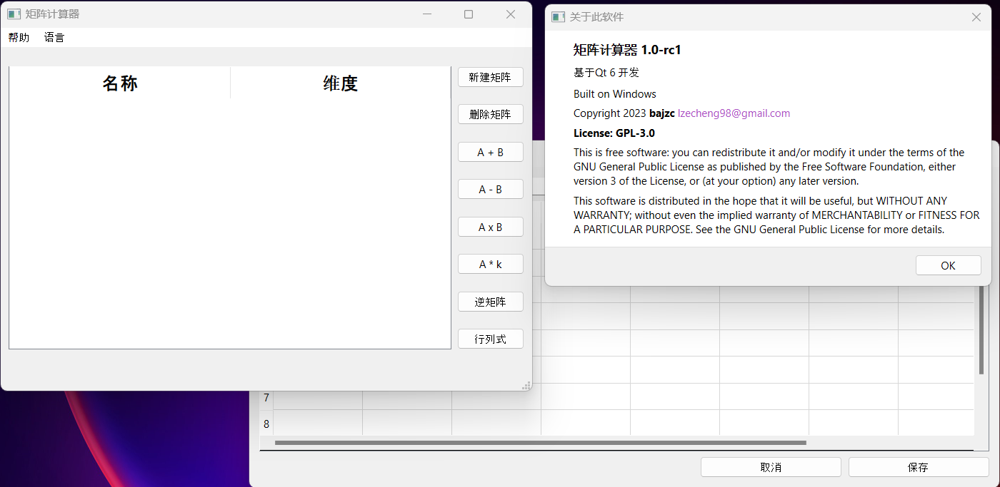

# GUI Version

A brief introduction to this repository:

| Branch                                                                       | Description                                                                                                                                                                       |
|------------------------------------------------------------------------------|-----------------------------------------------------------------------------------------------------------------------------------------------------------------------------------|
| [GUI](https://github.com/bajzc/Matrix_calculator/tree/GUI)                   | A user-friendly GUI matrix calculator, which is based on Qt framework and has capability to calculate expression. It supports six basic matrix operations                         |
| [demo](https://github.com/bajzc/Matrix_calculator/tree/demo)                 | A command line version using regular expressions based on finite state ideas, and also includes the development of a matrix library (LU decomposition)                            |
| [main](https://github.com/bajzc/Matrix_calculator/tree/main)                 | An interpreter has a similar syntax to MATLAB in terms of matrix creation and operation, it is highly efficient while supporting rich features (autocomplete, GNU-style argument) |
| [dev/AST-test](https://github.com/bajzc/Matrix_calculator/tree/dev/AST-test) | This branch is still in development. So far, the AST builder and walker have been completed, which means it can be linked with GCC JIT to generate executable files.              |

## Showcase

## Getting Start

[Download](https://github.com/bajzc/Matrix_calculator/releases)

## Run from source

For all OS, you may need to install Qt creator, and Eigen3 in order to compile from the source.

## License

**GPL-3.0 license**

This is free software: you can redistribute it and/or modify it under the terms of the GNU General Public License as published by the Free Software Foundation, either version 3 of the License, or (at your option) any later version.

This software is distributed in the hope that it will be useful, but WITHOUT ANY WARRANTY; without even the implied warranty of MERCHANTABILITY or FITNESS FOR A PARTICULAR PURPOSE.  See the GNU General Public License for more details.
