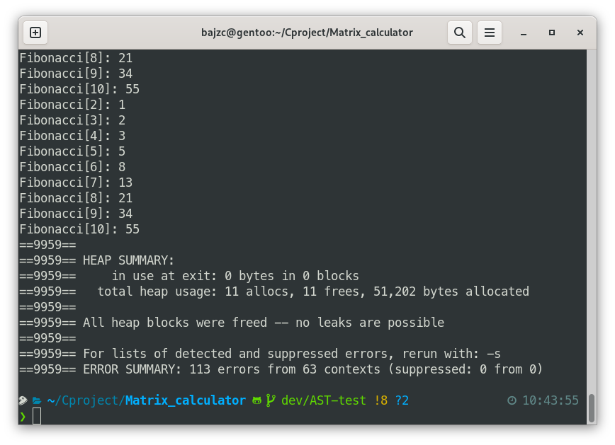

## AST-test

The implement by using AST tree.

### Features:

| Feature                      | Example                               |
|------------------------------|---------------------------------------|
| Arithmetic operators         | + - * / % ^                           |
| Comparison operators         | < <= == >= >                          |
| Postfix operators            | ++ --                                 |
| No declaration for variables | a=1;                                  |
| Multi-scope symbol table     | \                                     |
| Functions declaration        | define next(n){ printf("%d",n+1); }   |
| Function calls               | next(1+1);                            |

### Build

You need to install **libgccjit** for JIT compiler.

`make jit`

**Flex** and **Bison** for both targets

`make ast`


# Examples

## GCC JIT:
### Multipilcation Table
```C
define void table(a){
i=1;
while(i<=a){
	j=1;
	while(j<=i){
		printf("%.0lf * %.0lf = %.0lf\t",j,i,i*j);
		j=j+1;
	}
	printf("\n");
	i=i+1;
	}
}
table(9);
```


### Function Calls and Return
```C
define plus(a,b){
    return a+b;
}
printf("%.0lf + %.0lf = %.0lf\n",1,2,plus(1,2));
```

## AST walker:

### 1. Fibonacci

``` C
define fib(n){
    a = 0;b = 1;temp = 0;i = 1;
    while(i < n){
        temp = a+b;
        a = b;
        b = temp;
        i++;
    }
    printf("Fibonacci[%d]: %d\n",n,b);
}

a=1;
while(a<1000000){
    a++;
    b=1;
    while(b<10){
        b++;
        fib(b);
    }
}
```

`time cat fibonacci.test | ./a.out`

#### output:
```
......
Fibonacci[2]: 1
Fibonacci[3]: 2
Fibonacci[4]: 3
Fibonacci[5]: 5
Fibonacci[6]: 8
Fibonacci[7]: 13
Fibonacci[8]: 21
Fibonacci[9]: 34
Fibonacci[10]: 55

```



|malloc function| file     |time taken |
|---------------|----------|-----------|
|malloc()       |malloc.h  |25.202s    |
|mem_malloc()   |mem_pool.h|22.152s    |
|JIT compiled   |-         |16.975s    |

### 2. Multipilcation Table

```C
define table(n){
    i = 1;
    while(i <= n){
        j = 1;
        while(j <= i){
            printf("%d x %d = %d\t",j,i,i*j);
            j++;
        }
        printf("\n");
        i++;
    }
}
table(9);
```

### TODO

- [x] Function declaration
- [x] Memory pool
- [x] GCC JIT
